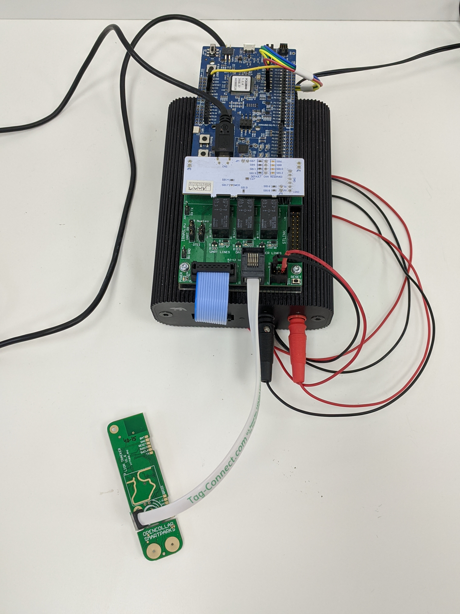
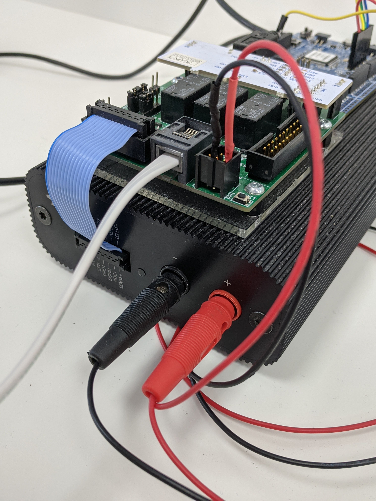
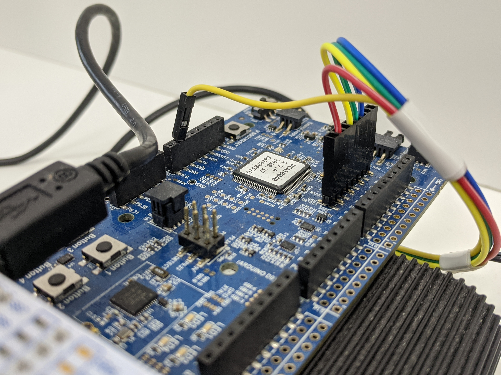
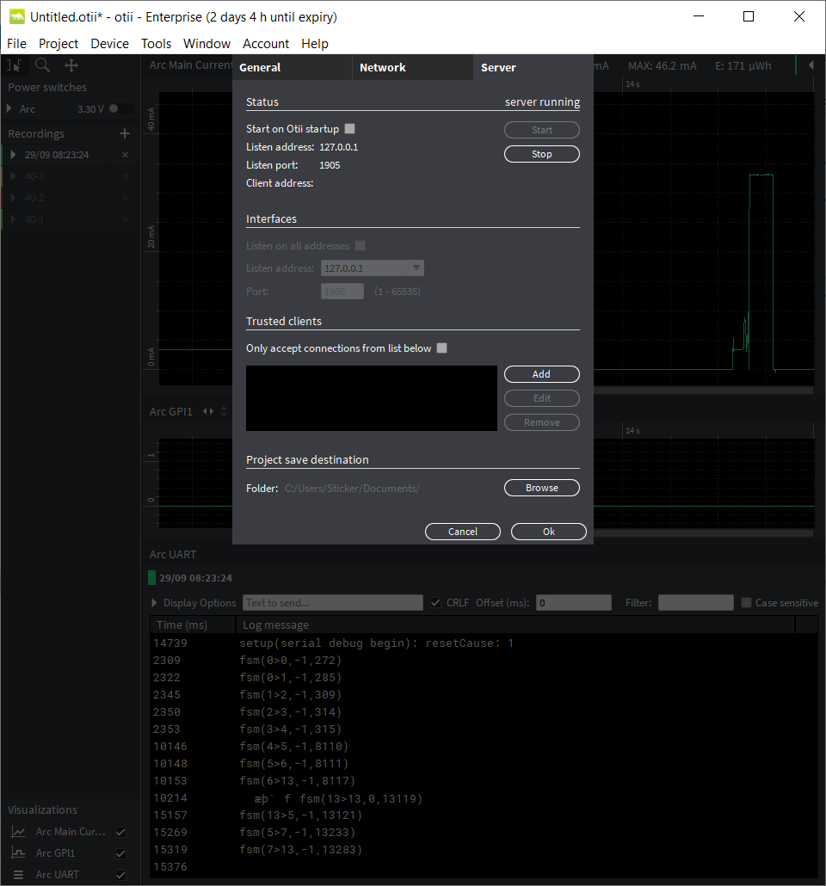
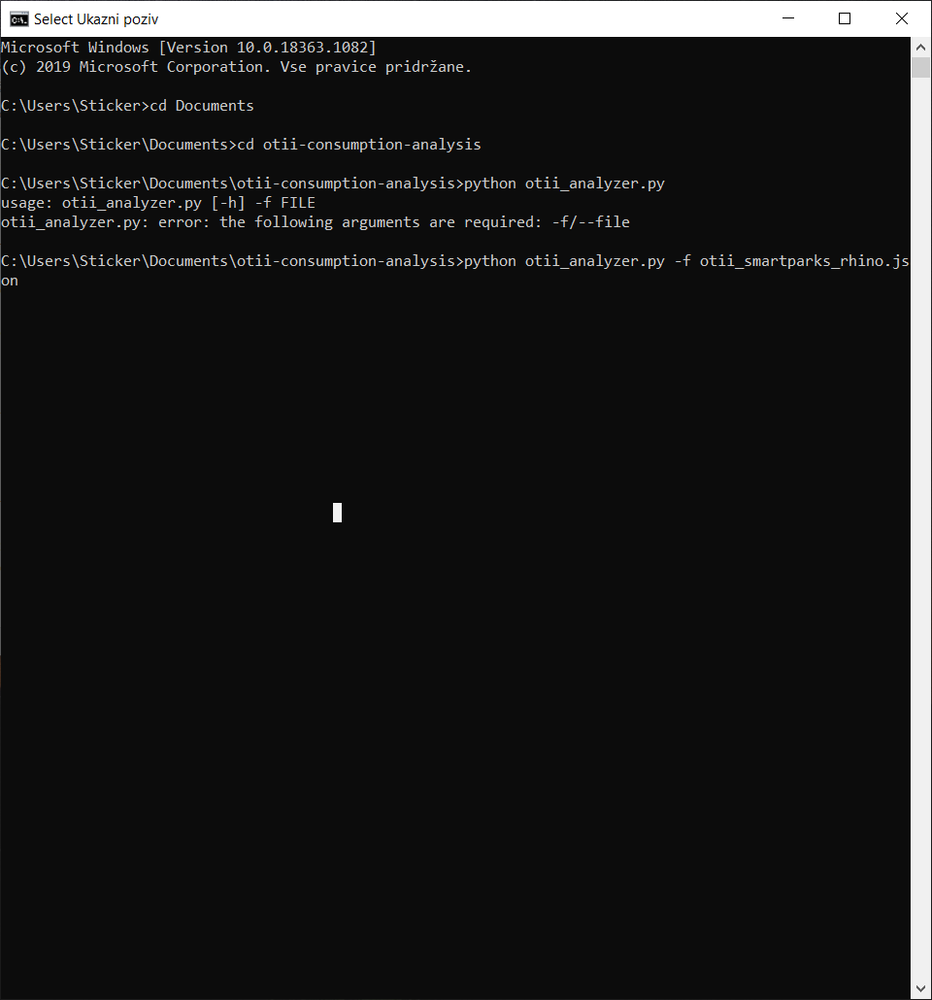

# Otii automatic consumption analyzer

The Otti server enables us to write automatic tests for energy consumption.
We meassure energy consumption between 2 messagess sent from the device via UART.

For testing a device, a `json` document must be specified as follows:

```javascript
{
    "hostname": "IP",
    "port": <PORT>,
    "arc_name": "Arc-name",
    "record_duration": <DURATION>,
    "message_pairs": [
        {
            "from": "message begin",
            "to": "message end",
            "avg_limit_low": <LIMIT LOW>,
            "avg_limit_high": <LIMIT HIGH>,
            "timeout": <TIMEOUT>
        },
        ...
    ]
}
```

- `"hostname"` is the IP of the Otti test client
- `"port"` is the PORT of the Otti test client
- `"arc_name"` is the name of the Arc (check in Otii -> Project -> Project Settings -> Arc -> INFO)
- `"message_pairs"` is an array of objects specifying each segment we want to measure:
  - `"from"` is the message where measuring begins
  - `"to"` is the message where measuring ends
  - `"avg_limit_low"` is the lowest amount of energy (in μWh) that can be used up in the specified duration (on average).
  - `"avg_limit_high"` is the highest amount of energy (in μWh) that can be used up in the specified duration (on average).
  - `"timeout"` is the highest amount of time (in ms) allowed between messages. If timeout is `0`, the limit is infinite.

Example json:

```json
{
    "hostname": "127.0.0.1",
    "port": 1905,
    "arc_name": "Arc",
    "record_duration": 20,
    "message_pairs": [
        {
            "from": "fsm(0, 1, 2)",
            "to": "fsm(1, 3, 7)",
            "avg_limit_low": 10,
            "avg_limit_high": 10.6,
            "timeout": 2000
        },
        {
            "from": "> PING",
            "to": "> PING 2",
            "avg_limit_low": 19.6,
            "avg_limit_high": 19.8,
            "timeout": 1770
        }
    ]
}
```

To run the tests, simply run:

```bash
./otii_analyzer.py -f <JSON FILENAME>
```

## Detailed instructions

1. Download "otii-consumption-analysis"

2. Connect otii setup to your computer and run Otii software - open New project.





```
otii settings:  new project
        project settings
        
        -> arc
        supply: power box
        main voltage: 3,30V
        over current protection: 0,500A
        digital voltage level: check ''same as supply''
        
        -> current 
        check main current
        check auto range
        
        -> voltage
        check GPI1 value
        
        -> logs
        check UART
        baud rate: 115200
```

3. In Otii software navigate to File -> Preferences -> Server and click "Start"



4. Connect the device via "tag-connect". To run the command use:
    a) Command Prompt
    b) Visual Studio Code
    
4.a) Navigate to your folder with "otii-consumption-analysis" and run "python .\otii_analyzer.py -f .\otii_smartparks_rhino.json"


4.b) Open file C:\Users\Sticker\Documents\otii-consumption-analysis
    
    run command: PS C:\Users\Sticker\Documents\otii-consumption-analysis> python .\otii_analyzer.py -f .\otii_smartparks_rhino.json
    
Log file after a successful test should look like this:

```
OK 0.0400186968914555 μWh
OK 0.2927783995633925 μWh
OK 0.029815154270834313 μWh
OK 0.012477693194445067 μWh
OK 140.1002367360885 μWh
OK 0.02873970756828776 μWh
OK 9.717506900152328 μWh
.
----------------------------------------------------------------------
Ran 1 test in 47.983s
OK
```
    
    


